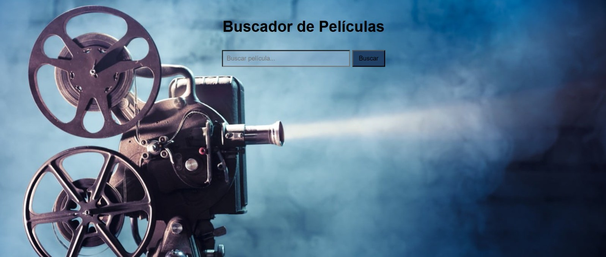

# 🎬 CineSearch

Aplicación web desarrollada con JavaScript que permite buscar películas utilizando la API de OMDb y mostrar los resultados de forma dinámica.

## 📸 Vista previa



## 🚀 Demo

Prueba la aplicación aquí:

https://leidyyesi.github.io/CineSearch/

## ✨ Características

* 🔎 Búsqueda de películas por título.
* 🌐 Consumo de datos desde la API de OMDb.
* 🎞️ Visualización de pósteres y año de estreno.
* ⏳ Indicador de carga durante la búsqueda.
* ⚠️ Manejo de errores cuando no se encuentran resultados.
* 📦 Organización del código mediante módulos ES6.

## 🛠️ Tecnologías utilizadas

* HTML5
* CSS3
* JavaScript (ES6+)
* Fetch API
* Async/Await
* OMDb API
* Git
* GitHub

## 📂 Estructura del proyecto

```text
CineSearch/
│
├── index.html
├── style.css
├── main.js
├── api.js
├── ui.js
├── config.js (local, no incluido en Git)
├── .gitignore
└── images/
```

## 🎯 Lo que aprendí

Durante este proyecto practiqué:

* Importación y exportación de módulos.
* Organización de código en múltiples archivos.
* Manipulación del DOM.
* Eventos y manejo de formularios.
* Consumo de APIs REST.
* Programación asíncrona con Async/Await.
* Uso de Fetch API.
* Depuración mediante DevTools.
* Control de versiones con Git y GitHub.

## 🧩 Desafíos resueltos

Durante el desarrollo resolví problemas reales como:

* Configuración de módulos ES6.
* Errores de CORS al trabajar con módulos.
* Activación y uso de una API Key.
* Organización de responsabilidades entre archivos.
* Uso de `.gitignore` para proteger información sensible.
* Resolución de conflictos entre repositorio local y remoto.

## ⚙️ Instalación

1. Clonar el repositorio:

```bash
git clone https://github.com/LeidyYesi/CineSearch.git
```

2. Abrir el proyecto en VS Code.

3. Crear un archivo `config.js` con una API Key válida de OMDb:

```js
export const API_KEY = "TU_API_KEY";
```

4. Ejecutar el proyecto con Live Server.

## 🔮 Mejoras futuras

* Buscar al presionar Enter.
* Mostrar información detallada de cada película.
* Diseño responsive para móviles.
* Modal con detalles completos.
* Sistema de favoritos con Local Storage.
* Publicación mediante GitHub Pages.

## 👩‍💻 Autor

Desarrollado por Yesica Farias como parte de su proceso de aprendizaje en desarrollo web y JavaScript moderno.
